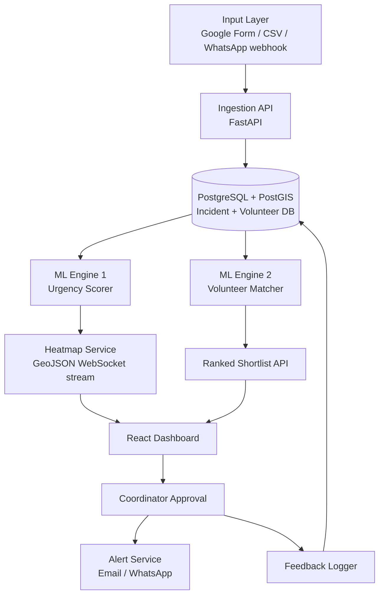
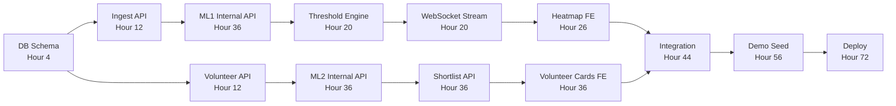

# VolunteerIQ — 80-Hour Prototype Execution Plan

> **Team of 4** | Frontend Engineer · Backend Engineer · ML Engineer 1 (Urgency/Heatmap) · ML Engineer 2 (Volunteer Matching)
> **Clock starts:** Hour 0 | **Prototype Demo:** Hour 80

---

## System Overview



---

## Tech Stack

| Layer | Tech | Reason |
|---|---|---|
| Frontend | React + Vite, Leaflet.js, Recharts | Fast HMR, best map library, lightweight charts |
| Backend API | FastAPI (Python) | Async, auto-docs, easy ML integration |
| Database | PostgreSQL + PostGIS | Geo queries, spatial indexing |
| ML Runtime | scikit-learn, LightGBM, sentence-transformers | Prototype-grade, no GPU needed |
| Real-time | WebSockets (FastAPI native) | Live heatmap updates |
| Alerts | SendGrid free tier / Twilio WhatsApp sandbox | Zero infra for demo |
| Auth | FastAPI-Users (JWT) | One-line setup |
| Deployment | Railway / Render (backend) + Vercel (frontend) | Free tier, deploy in minutes |
| Data seeding | Faker + custom script | Realistic demo data fast |

---

## Role Definitions

| Role | Person | Primary Responsibility |
|---|---|---|
| **FE** | Frontend Engineer | React Dashboard, Heatmap UI, volunteer cards, alert flow |
| **BE** | Backend Engineer | FastAPI, DB schema, ingestion endpoints, WebSocket, alerts |
| **ML1** | ML Engineer 1 | Urgency scoring model, heatmap generation, threshold engine |
| **ML2** | ML Engineer 2 | Volunteer match scoring, ranked shortlist API, feedback loop |

---

## Phase Breakdown

---

### 🔴 Phase 0 — Alignment & Scaffold (Hours 0–4)
**ALL HANDS**

#### Hour 0–1: Kick-off
- Agree on: city/region for demo data (pick one real city like Bengaluru/Nairobi), 5 crisis categories (food insecurity, medical emergency, shelter, sanitation, child welfare), 4 skill buckets (first aid, logistics, counseling, general)
- Lock API contract: FE and BE co-write `api_contract.md` — all endpoint shapes, WebSocket message schema

#### Hour 1–4: Parallel Environment Setup
| FE | BE | ML1 | ML2 |
|---|---|---|---|
| `npm create vite@latest volunteeriq-fe` | `fastapi` project + PostgreSQL local | Set up Jupyter environment | Set up Jupyter environment |
| Install: Leaflet, Recharts, Axios, socket.io-client | SQLAlchemy + Alembic migrations | Generate 500 synthetic incidents | Generate 200 synthetic volunteer profiles |
| Scaffold routes: `/dashboard`, `/volunteers`, `/deployments` | Implement DB schema (see below) | EDA on incident data | EDA on volunteer data |

**DB Schema (BE designs, all agree):**
```sql
-- incidents table
id, report_text, category, lat, lng, zone_id, 
severity_raw, urgency_score, status, created_at, resolved_at

-- volunteers table  
id, name, skills[], availability_json, home_lat, home_lng,
deployment_count, rating, is_available, created_at

-- deployments table
id, incident_id, volunteer_id, matched_at, approved_at,
outcome_score, response_time_mins, resolved_at

-- zones table
id, name, geojson_polygon, urgency_level, last_updated
```

**Deliverable of Phase 0:** Repos on GitHub, DB migrations running, each member unblocked with test data.

---

### 🟠 Phase 1 — Core Build (Hours 4–36)

#### BE Track (Hours 4–36)

**Hours 4–12: Ingestion + Volunteer APIs**
- `POST /api/ingest` — Accepts JSON body (from Google Form webhook or CSV row). Normalizes fields, writes to `incidents` table
- `POST /api/ingest/csv` — Bulk CSV upload endpoint, parse with `pandas`, upsert
- `GET /api/volunteers` — Paginated, filterable by skill/availability/zone
- `POST /api/volunteers` — Register new volunteer
- `GET /api/incidents` — With filters: zone, status, urgency range
- `GET /api/zones/heatmap` — Returns GeoJSON FeatureCollection with urgency scores per zone

**Hours 12–20: WebSocket + Threshold Engine**
```python
# Pseudo-logic for threshold engine (BE implements, calls ML1's scorer)
async def check_threshold(zone_id):
    score = await compute_urgency(zone_id)          # calls ML1 endpoint
    if score > URGENCY_THRESHOLD:                    # configurable, default 0.75
        shortlist = await get_volunteer_shortlist(zone_id)  # calls ML2
        await broadcast_alert_to_dashboard(zone_id, shortlist)
```
- WebSocket endpoint: `ws://api/ws/heatmap` — pushes zone urgency updates every 30s or on new incident
- `POST /api/deployments/approve` — Coordinator approval flow → triggers alert dispatch

**Hours 20–36: Alert Service + Feedback**
- Integrate SendGrid: confirmation email to volunteer on approval
- `POST /api/deployments/{id}/outcome` — Logs resolution outcome, response time, volunteer rating
- Google Form webhook handler (receive form submission, map fields to incident schema)

---

#### ML1 Track — Urgency Scoring (Hours 4–36)

**Hours 4–12: Data & Feature Engineering**
- Generate synthetic incident dataset: 500 records with `category`, `report_text`, `time_of_day`, `historical_count_last_7d`, `zone_population_density`, `days_since_last_resolution`
- Features for urgency model:
  ```
  - incident_category (one-hot)
  - recent_report_velocity (incidents/hour in zone)
  - time_sensitivity_score (NLP from report_text — keyword urgency)
  - zone_vulnerability_index (population density × historical severity)
  - days_unresolved
  ```

**Hours 12–24: NLP Sub-Component**
- Use `sentence-transformers` (`all-MiniLM-L6-v2`) to embed `report_text`
- Train a lightweight classifier on top: `[critical, urgent, moderate, low]`
- Map class probabilities → 0–1 urgency contribution score
- **No GPU needed** — MiniLM is 80MB, runs on CPU under 100ms/query

**Hours 24–36: Zone Urgency Aggregator**
- Aggregate per-zone: weighted mean of individual incident urgency scores, decayed by report age (exponential decay, half-life = 6 hours)
- Formula: `zone_urgency = Σ (incident_score × e^(-λ × hours_old)) / zone_area_sqkm`
- Train a calibration layer with LightGBM: input = aggregated features, output = final 0–1 zone urgency
- Expose as `POST /ml/urgency/zone` internal API (FastAPI sub-router)
- Deliver GeoJSON with `urgency` property per zone feature

---

#### ML2 Track — Volunteer Matching (Hours 4–36)

**Hours 4–12: Volunteer Profile Encoding**
- Encode volunteer profiles as feature vectors:
  ```
  - skill_match_score: overlap between volunteer.skills and incident.required_skills (Jaccard)
  - proximity_score: 1 / (1 + distance_km) — Haversine from volunteer home to zone centroid
  - availability_score: binary match against current time slot
  - experience_score: log(deployment_count + 1) × mean(past_ratings)
  - current_load: 0 if available, penalized if already deployed
  ```

**Hours 12–24: Matching Algorithm**
- **V1 (hours 12–18):** Weighted linear scoring
  ```python
  match_score = (
      0.35 * skill_match +
      0.25 * proximity +
      0.20 * availability +
      0.15 * experience +
      0.05 * (1 - current_load)
  )
  ```
- **V2 (hours 18–24):** LightGBM ranker trained on synthetic historical deployment outcomes (did this volunteer successfully complete the task?)
- Expose as `POST /ml/match/volunteers` → takes zone_id + required_skills → returns ranked list of top-5 volunteers

**Hours 24–36: Feedback Integration Hook**
- Schema for feedback: `{deployment_id, resolved: bool, response_time_mins, coordinator_rating}`
- On feedback receipt: update volunteer `rating` rolling average, retrain ranker if feedback_count > 50 (background job)
- Design the retraining loop (even if not live in prototype, document it and mock it)

---

#### FE Track (Hours 4–36)

**Hours 4–14: Core Dashboard Shell**
- Dark-mode design system (CSS variables: deep navy `#0A0E1A`, accent purple `#7C3AED`, danger red `#EF4444`, warning amber `#F59E0B`, success green `#10B981`)
- Header with: VolunteerIQ logo, live clock, active deployment count badge
- Left sidebar: Zone urgency ranking list (sorted high → low, color-coded)
- Main pane: Leaflet map

**Hours 14–26: Heatmap Map Component**
- Integrate Leaflet.js with OpenStreetMap tiles
- Render zone GeoJSON as polygons colored by urgency (green → amber → red gradient)
- WebSocket hook: `useHeatmapSocket()` — subscribes to `ws/heatmap`, patches zone colors on update
- Click on zone → side panel opens with: zone name, urgency score, recent incidents list, "Mobilize" button

**Hours 26–36: Volunteer Panel + Approval Flow**
- On "Mobilize" click: fetch ranked shortlist from `GET /api/deployments/shortlist?zone_id=X`
- Render top-5 volunteer cards: name, skill tags, distance badge, availability indicator, match score bar
- "Deploy" button on card → `POST /api/deployments/approve` → confirmation toast → volunteer card grays out
- Deployment history tab with outcome log

---

### 🟡 Phase 2 — Integration Sprint (Hours 36–56)

**ALL HANDS — Connect all layers**

#### Hours 36–44: FE ↔ BE Integration
- Replace all mock data in FE with real API calls
- Test WebSocket live update: ingest a new incident → watch zone color shift on map
- Test approval flow end-to-end: click Deploy → check DB deployment row → check email in SendGrid

#### Hours 44–50: BE ↔ ML Integration
- Wire urgency endpoint: BE calls `POST /ml/urgency/zone` on new incident ingest
- Wire matching endpoint: BE calls `POST /ml/match/volunteers` when coordinator requests shortlist
- Validate response shapes match API contract

#### Hours 50–56: Data Seeding & Demo Scenario Prep
- Seed 5 distinct zones, 500 incidents spread over 7 days, 200 volunteers
- Create a **scripted demo flow:**
  1. Start with calm map (all zones green/amber)
  2. Run `seed_crisis.py` — floods zone 3 with 12 food insecurity reports
  3. Watch map turn red live
  4. Heatmap threshold fires → shortlist appears
  5. Coordinator approves top volunteer
  6. Email arrives (open Inbox on demo screen)
  7. Mark outcome → show feedback completing the loop

---

### 🟢 Phase 3 — Polish & Hardening (Hours 56–72)

#### FE (Hours 56–72)
- [ ] Add a Google Form embed panel (input channel demo)
- [ ] Urgency trend charts per zone (Recharts line chart, last 24h)
- [ ] Volunteer availability calendar heatmap
- [ ] Notification bell with live deployment alerts
- [ ] Mobile responsive layout (min 768px breakpoint)
- [ ] Loading skeletons on all async fetches
- [ ] Error boundary components

#### BE (Hours 56–72)
- [ ] Rate limiting on `/api/ingest`
- [ ] Basic JWT auth on dashboard routes
- [ ] Health check endpoint `GET /health`
- [ ] Background job: re-score all zones every 5 minutes (APScheduler)
- [ ] Logging middleware with request ID

#### ML1 (Hours 56–70)
- [ ] Calibrate threshold values on synthetic data
- [ ] Add confidence interval to urgency score for UI display
- [ ] Document model card (inputs, outputs, calibration method)

#### ML2 (Hours 56–70)
- [ ] Validate match rankings on 3 synthetic scenarios, report NDCG
- [ ] Add explainability: `why_matched` string per volunteer ("Closest trained first-aider, 0.8km away")
- [ ] Stress test: 200 volunteers, rank in < 500ms

---

### 🔵 Phase 4 — Demo Prep & Buffer (Hours 72–80)

| Hour | Task | Owner |
|---|---|---|
| 72–74 | Deploy backend to Render/Railway, FE to Vercel | BE |
| 74–76 | Full end-to-end demo run on production URLs (not localhost) | ALL |
| 76–77 | Bug triage: fix only P0s (demo breaks) | ALL |
| 77–79 | Record 2-min demo video (scripted flow from Phase 2) | FE |
| 79–80 | Finalize README, architecture diagram, pitch notes | ALL |

---

## Hour-by-Hour Timeline Summary

```
Hour  0 ─── 4   │ [ALL]   Alignment, scaffold, DB schema, env setup
Hour  4 ─── 12  │ [BE]    Ingest + Volunteer APIs | [ML1] Feature eng | [ML2] Profile encoding | [FE] Dashboard shell
Hour 12 ─── 20  │ [BE]    WebSocket + threshold engine | [ML1] NLP urgency | [ML2] V1 match scorer | [FE] Leaflet map
Hour 20 ─── 28  │ [BE]    Alert service + feedback API | [ML1] Zone aggregator | [ML2] LightGBM ranker | [FE] Zone side panel
Hour 28 ─── 36  │ [BE]    Polish APIs, add docs | [ML1] Internal API | [ML2] Feedback hook | [FE] Volunteer cards + approval
Hour 36 ─── 44  │ [ALL]   FE ↔ BE integration
Hour 44 ─── 50  │ [ALL]   BE ↔ ML integration
Hour 50 ─── 56  │ [ALL]   Data seed + demo scenario script
Hour 56 ─── 72  │ [ALL]   Polish, hardening, error handling, mobile layout
Hour 72 ─── 80  │ [ALL]   Deploy to cloud, demo run, P0 fixes, record video
```

---

## Critical Path & Dependencies



> [!IMPORTANT]
> **The DB schema and API contract (Hour 0–4) is the single highest-risk dependency.** Any change after Hour 4 cascades to all four tracks. Freeze it early.

---

## Risk Register

| Risk | Probability | Impact | Mitigation |
|---|---|---|---|
| PostGIS geo queries slow | Medium | High | Add `GIST` index on `geom` columns in migration |
| NLP model too slow on CPU | Low | High | Fallback: TF-IDF + keyword list urgency scorer (1 hour to build) |
| WhatsApp webhook setup complex | High | Medium | **Cut for demo** — use Google Form + CSV only |
| WebSocket race conditions | Medium | Medium | Debounce zone updates on BE, idempotent zone_id messages |
| Volunteer email undelivered | Low | Low | Demo with console log as fallback, SendGrid sandbox mode |
| Scope creep in FE polish | High | Medium | FE works from a component checklist, no feature additions after Hour 56 |

---

## What "Done" Looks Like at Hour 80

- [ ] Live URL (not localhost) loads a dark-mode coordinator dashboard
- [ ] Map shows ≥ 5 color-coded zones with real urgency scores
- [ ] Running `seed_crisis.py` turns a zone red within 60 seconds
- [ ] "Mobilize" surfaces a ranked list of ≥ 3 real volunteers with match scores
- [ ] "Deploy" sends a real email to a demo inbox
- [ ] Outcome logging completes the visible loop
- [ ] 2-minute recorded demo video exists

---

## Appendix: Recommended Libraries

```txt
# Backend (requirements.txt)
fastapi==0.111.0
uvicorn[standard]
sqlalchemy[asyncio]
asyncpg
alembic
geoalchemy2
python-jose[cryptography]
passlib[bcrypt]
pandas
sentence-transformers
lightgbm
scikit-learn
apscheduler
sendgrid
python-multipart
faker

# Frontend (package.json)
react, react-router-dom
leaflet, react-leaflet
recharts
axios
socket.io-client
date-fns
```

---

## Appendix: Synthetic Data Quick-Start

```python
# seed.py — run this at Hour 4
from faker import Faker
import random, json

fake = Faker()
CATEGORIES = ["food_insecurity","medical","shelter","sanitation","child_welfare"]
SKILLS = ["first_aid","logistics","counseling","general"]

# Bengaluru bounding box
LAT_RANGE = (12.85, 13.10)
LNG_RANGE = (77.50, 77.75)

incidents = [{
    "report_text": fake.sentence(nb_words=12),
    "category": random.choice(CATEGORIES),
    "lat": random.uniform(*LAT_RANGE),
    "lng": random.uniform(*LNG_RANGE),
    "severity_raw": random.randint(1, 5),
    "created_at": fake.date_time_between(start_date="-7d")
} for _ in range(500)]

volunteers = [{
    "name": fake.name(),
    "skills": random.sample(SKILLS, k=random.randint(1,3)),
    "availability_json": {"Mon":[9,17],"Wed":[14,20],"Sat":[8,18]},
    "home_lat": random.uniform(*LAT_RANGE),
    "home_lng": random.uniform(*LNG_RANGE),
    "deployment_count": random.randint(0,15),
    "rating": round(random.uniform(3.5, 5.0), 1),
} for _ in range(200)]
```
