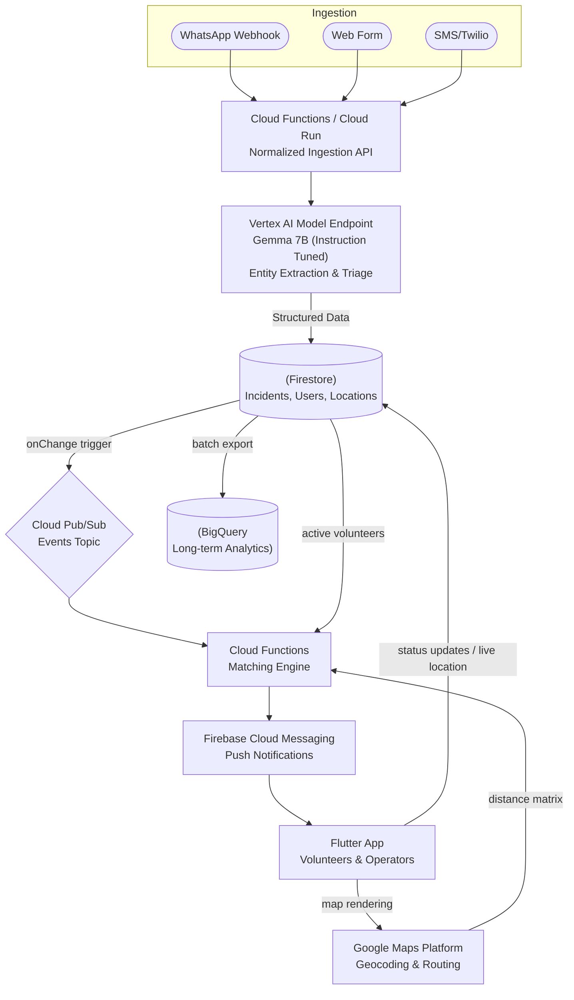

# VolunteerIQ Technical Plan

## 1. System Overview

VolunteerIQ is a real-time, AI-driven volunteer dispatch and coordination platform. The core objective is to reduce the friction between incident identification and volunteer mobilization during community events, emergencies, or rapid-response scenarios. 

**Main Components & Responsibilities:**
- **Ingestion Gateway:** normalized API boundary for receiving semi-structured or unstructured signals (WhatsApp, Web Forms, SMS).
- **Intelligence Layer (AI):** parses unstructured text into structured JSON payloads (location, severity, required skills, urgency) using Google's open-weights Gemma model on Vertex AI.
- **Control Plane:** the backend orchestration engine handling state management, volunteer matching, and push delivery.
- **Data Persistence & Pub/Sub:** hot path real-time document store combined with an event bus for asynchronous processing.
- **Client Application:** Flutter-based mobile interface primarily for volunteers (to accept tasks and share live location) and operators (map-based dashboard).

**Real-Time & Scalability Philosophy:**
The system favors asynchronous, event-driven architectures. Client apps subscribe directly to Firestore document streams for live updates rather than polling REST APIs. Heavy computational loads (AI parsing with Gemma, complex geospatial queries) are offloaded to Cloud Functions or Cloud Run instances triggered by Pub/Sub or Firestore lifecycle events, ensuring the control plane remains non-blocking. 

## 2. Architecture Diagram



## 3. Detailed Tech Stack

- **Frontend (Flutter):** 
  - **Architecture:** Feature-first modular design.
  - **State Management:** Riverpod for reactive caching and dependency injection.
  - **Maps Integration:** `google_maps_flutter` for rendering highly customized map layers.
- **Backend (Firebase & GCP):**
  - **Auth:** Firebase Authentication (Phone, Google OAuth, Email/Password).
  - **Database:** Firestore (NoSQL, real-time snapshot listeners).
  - **Compute:** Cloud Functions (2nd Gen, powered by Cloud Run). Used for lightweight triggers (e.g., Firestore document creation triggers the matching engine).
- **AI/ML (Vertex AI & Gemma):**
  - **Model:** `gemma-7b-it` deployed via Vertex AI Model Garden endpoints. Using an open-weights model ensures maximum control, data privacy, and the ability to fine-tune directly on GCP without data leaving the tenant infrastructure.
- **Mapping (Google Maps Platform):**
  - **Geocoding API:** To convert textual addresses into Lat/Lng coordinates.
  - **Distance Matrix API:** Used in the matching engine to calculate real travel times rather than simple Haversine (crow-flies) distance.
- **Notifications:** Firebase Cloud Messaging (FCM) for low-latency push notifications.
- **Analytics & Pipeline:**
  - **BigQuery:** Firestore data is continuously exported to BigQuery for historical batch analytics (identifying systemic bottlenecks, average response times).

**Why this stack:** Google-first ecosystem reduces integration overhead. Firebase handles real-time sync and auth out of the box, while Cloud Functions, Pub/Sub, and Vertex AI provide an elastic backend that scales to zero and handles spike loads elegantly while maintaining full oversight over the open-weights AI model.

## 4. Core Features and Implementation Plan

### 1. Multi-source Incident Ingestion
- **What it does:** Accepts unstructured reports "Tree fell on Main St." from multiple platforms.
- **How it works:** A unified HTTP endpoint (Cloud Function) receives payloads, standardizes the schema, and writes a raw `Incident` document to Firestore.
- **GCP Services:** Cloud Functions.
- **MVP version:** Support manual entry via Flutter app and a simple simulated webhook.

### 2. AI-based Incident Parsing
- **What it does:** Converts raw text into structued fields: `{ "category": "debris", "priority": "high", "location": "Main St" }`.
- **How it works:** A Firestore `onCreate` trigger fires, sending the raw text to a deployed Gemma Vertex AI endpoint using a strict JSON schema prompt. The result updates the document.
- **GCP Services:** Cloud Functions, Vertex AI (Gemma Endpoint).
- **MVP version:** 100% required. Parse category, priority, and approximate location.

### 3. Hotspot Detection / Geospatial Clustering
- **What it does:** Groups nearby incidents of the same type to optimize volunteer deployment.
- **How it works:** Cloud Function runs a clustering algorithm (e.g., HDBSCAN) on recent unassigned incidents. Updates a `Hotspots` collection.
- **GCP Services:** Cloud Functions, Firestore.
- **MVP version:** Can be simplified. Just display individual pins on the map.

### 4. Volunteer Matching Engine
- **What it does:** Finds the optimal volunteers for a specific incident.
- **How it works:** Triggers on a new parsed incident. Queries Firestore for available volunteers within a bounding box (Geohash). Calculates a score for each, selects the top N, and flags them.
- **GCP Services:** Firestore (Geoqueries), Maps Distance Matrix API.
- **MVP version:** Basic Haversine distance threshold + skill string match.

### 5. Real-time Map UI
- **What it does:** Gives operators a live view of incidents and volunteer locations.
- **How it works:** Flutter streams the `Incidents` and `Volunteers` collections. State updates instantly move markers.
- **GCP Services:** Firebase SDK, Google Maps Platform.
- **MVP version:** Show standard markers for open/assigned incidents and active volunteers.

### 6. Push Notification System
- **What it does:** Alerts matched volunteers to a new task.
- **How it works:** The Matching Engine writes to a `Dispatch` subcollection, which triggers an FCM payload to the volunteer's device token.
- **GCP Services:** Firebase Cloud Messaging.
- **MVP version:** Standard pop-up notification with "Accept" / "Decline" actions.

### 7. Feedback and Learning Loop
- **What it does:** Improves matching based on past success/failure.
- **How it works:** After an incident closes, response times and volunteer ratings are logged to BigQuery. Later, this trains a custom ranking model.
- **GCP Services:** BigQuery, Vertex AI.
- **MVP version:** Skip ML training; just log the outcome timestamps to Firestore for basic reporting.

## 5. Machine Learning / AI Design

**Primary AI Workload: Real-Time Information Extraction**
- **Trigger:** Cloud function triggered by raw data ingestion.
- **Model:** `gemma-7b-it` (Instruction tuned model from Google, deployed on Vertex AI).
- **Prompt Architecture:** We will use few-shot examples to enforce schema extraction out of Gemma.
  - *Instruction/Context:* "Extract entities from this emergency dispatch text into a strict JSON object mapping to: location, skills_required, severity (1-5), and category."
  - *Input:* "Burst pipe flooding the basement at 123 Oak St. Need someone strong to help carry sandbags. 5 mins ago."
  - *Output:* `{ "location": "123 Oak St", "skills_required": ["heavy_lifting"], "severity": 4, "category": "water_damage" }`

**Matching Algorithm Upgrades (Post-MVP):**
The initial matching is rule-based (distance + skill overlap). The future state utilizes Vertex AI Search & Conversation (Vector Search) or a custom TensorFlow model trained on BigQuery historical data to predict *Probability of Acceptance (pAccept)*. 

## 6. Firestore Database Schema

Firestore restricts query capabilities (no complex JOINs), so data must be denormalized.

```json
// Collection: users/{userId}
{
  "uid": "abc123xyz",
  "name": "Jane Volunteer",
  "skills": ["first_aid", "heavy_lifting", "transport"],
  "status": "available", // available, busy, offline
  "location": {
    "geohash": "9q8yy",
    "lat": 37.7749,
    "lng": -122.4194
  },
  "trust_score": 4.8,
  "fcm_token": "dkj93kd..."
}

// Collection: incidents/{incidentId}
{
  "id": "inc_992",
  "raw_text": "Need help with a fallen tree...",
  "status": "pending", // pending, dispatched, resolved
  "created_at": "2026-04-24T10:00:00Z",
  "ai_parsed": {
    "category": "debris",
    "urgency_score": 3,
    "required_skills": ["heavy_lifting", "chainsaw"]
  },
  "location": {
    "address": "100 Main St",
    "lat": 37.7750,
    "lng": -122.4180
  },
  "assigned_volunteers": ["abc123xyz"]
}

// Collection: incidents/{incidentId}/dispatches/{dispatchId}
// Used to track which users were pinged and their responses
{
  "volunteer_id": "abc123xyz",
  "status": "notified", // notified, accepted, rejected
  "timestamp": "2026-04-24T10:01:00Z"
}
```

## 7. Matching Algorithm

**MVP Step-by-Step Logic:**
1. **Filter:** Geohash bounding box query on `users` collection to find `status == 'available'` within ~10km of the incident.
2. **Score:** Evaluate the candidate pool in memory (Cloud Function).
3. **Rank:** Sort by total score descending.
4. **Dispatch:** Send FCM to the top 3 candidates. If none accept within 2 minutes, fallback to the next 3.

**Scoring Equation:**
`Total Score = (w1 * DistanceScore) + (w2 * SkillMatch) + (w3 * TrustScore)`

**Pseudocode:**
```python
def rank_volunteers(incident, candidates):
    ranked = []
    
    for candidate in candidates:
        # Distance (0 to 1, Closer is higher)
        dist_km = calculate_haversine(incident.lat, incident.lng, candidate.lat, candidate.lng)
        dist_score = max(0, 1 - (dist_km / 10.0))
        
        # Skill Overlap (0 to 1)
        req_skills = set(incident.ai_parsed.required_skills)
        user_skills = set(candidate.skills)
        skill_score = len(req_skills.intersection(user_skills)) / max(1, len(req_skills))
        
        # Trust (0 to 1)
        trust_score = candidate.trust_score / 5.0
        
        # Weights
        final_score = (0.5 * dist_score) + (0.3 * skill_score) + (0.2 * trust_score)
        
        if skill_score > 0.0 or len(req_skills) == 0: # Must have at least one applicable skill
            ranked.append((candidate.id, final_score))
            
    return sorted(ranked, key=lambda x: x[1], reverse=True)
```

## 8. Scalability and Production Readiness

- **Handling 10K+ Incidents:** Firestore easily handles reads at this scale, but writes are limited to 10k/sec per database. The ingestion Cloud Function will batch writes or push to Pub/Sub under massive load to smooth out write spikes. 
- **Real-time Map:** Rendering 10k pins on modern mobile devices crushes the main thread. The Flutter app must use cluster-managers for the map view, combining markers dynamically based on zoom level.
- **Queueing and Retry:** External API calls (Vertex AI Gemma predictions, Google Maps) must be wrapped in Cloud Tasks with exponential backoff to handle rate-limiting.
- **Cost Avoidance:** Heavy reads from the map UI should not query Firestore continuously. We will utilize Firestore client-side caching heavily, and only stream document diffs. 

## 9. MVP vs Advanced Version

| Feature | Hackathon MVP | Production / Startup Phase |
| :--- | :--- | :--- |
| **Ingestion** | Simple web form & Flutter app input. | WhatsApp Business API, Twilio SMS integrations, Voice-to-Text. |
| **AI Parsing** | `gemma-7b-it` JSON extraction. | Gemma finetuned utilizing LoRA on Vertex AI specifically for disaster response datasets. |
| **Matching** | Haversine distance + basic scoring rule. | Google Maps Distance Matrix (traffic-aware) + ML acceptance probability scoring. |
| **UI** | Basic map markers & list views. | Map clustering, offline-first capabilities for low-bandwidth zones. |
| **Analytics** | Firestore basic counters. | Continuous BigQuery export layered with Looker Studio dashboards. |

## 10. Execution Roadmap

Assuming a 72-hour hackathon.

**Day 1: Foundation & Data Flow (The Plumbing)**
- **Priorities:** Setup Firebase project. One-click deploy `gemma-7b-it` from Vertex AI Model Garden to an Endpoint. Build Flutter auth flow. Define Firestore schemas. Write the Cloud Function for Gemma JSON extraction.
- **Dependencies:** Google Cloud Billing, API enablement, Vertex AI quota constraints.
- **If short on time:** Mock the authentication. Hardcode a single test user ID. 

**Day 2: The Core Loop (Matching & UI)**
- **Priorities:** Build the Map UI in Flutter. Stream Firestore markers to the map. Write the Matching Engine Cloud Function to rank volunteers and trigger an FCM token.
- **Dependencies:** FCM configuration for iOS/Android (can be tedious).
- **If short on time:** Skip FCM push notifications. Have the app poll/listen to a direct "assigned to me" collection.

**Day 3: Polish & Pitch (The "Wow" Factor)**
- **Priorities:** Refine the scoring algorithm. Build an operator dashboard view. Polish the Gemma prompt to handle edge-case text inputs gracefully. Record demo video.
- **Dependencies:** Functional MVP from Day 2.
- **If short on time:** Cut operator dashboard. Focus entirely on the Volunteer's mobile experience and the AI extraction success rate.

## 11. Competitive Edge

Why this wins at a Google Hackathon:
1. **Google Native & Open Models:** It seamlessly weaves together Firebase (Auth/Store/FCM), Google Cloud (Functions), Maps Platform, and pioneers usage of Google's open-weights **Gemma** model on Vertex AI—proving privacy-first AI on GCP.
2. **Beyond Toy Wrappers:** Many hackathon projects are just thin UI wrappers over an LLM chat endpoint. VolunteerIQ uses Gemma as a hidden piece of infrastructure (a data parser/classifier) driving an algorithmic backend, which commands far more engineering respect.
3. **High Impact:** The problem space (disaster response, mutual aid) aligns with Google's mission to organize the world's information and make it universally accessible and useful, extending that to the physical world. 
4. **Viable Business Path:** With analytics and scalable architecture built-in, this scales naturally from local community mutual aid to enterprise NGO dispatch software.
